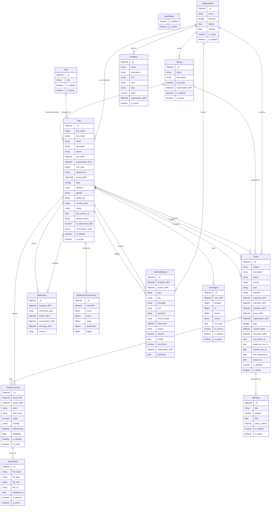

# Entity Relationship Diagram (ERD)

This document outlines the data models and their relationships within the OrbitDesk application.

## Model Descriptions

- **Organization**: The top-level entity representing a company or tenant.
- **User**: Represents all actors in the system (Admins, Agents, Customers).
- **Role**: Defines the permissions and role type for a user (e.g., Admin, Agent).
- **Group**: A collection of users (e.g., "Support Team", "Sales").
- **Ticket**: The core unit of work, representing a support request.
- **TicketComment**: Updates and communication threads within a ticket.
- **SlaPolicy**: Service Level Agreement policies that determine ticket due dates.
- **Category**: Classification for tickets or knowledge base articles (though KB wasn't scanned, Category is generic).
- **Notification**: System-level notifications (likely mainly email/backend triggers).
- **UserNotification**: In-app notifications for users.
- **NotificationPreferences**: User-specific settings for how they want to be notified.
- **UserAgent**: Tracks devices and browsers used by users for security and auditing.
