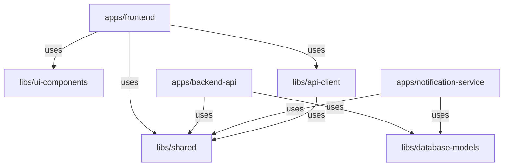

# SupportDesk Architecture

## Monorepo Overview

This project uses Nx to manage a monorepo containing multiple applications and shared libraries.

## Application Architecture

### Frontend (`apps/frontend`)
- **Framework**: React 19 with Vite 7
- **Routing**: React Router DOM v7
- **State Management**: React Context API
- **Styling**: Vanilla CSS with CSS custom properties
- **UI Components**: Shared via `@supportdesk/ui-components`

### Backend API (`apps/backend-api`)
- **Runtime**: Node.js
- **Framework**: Express 5
- **Database**: MongoDB with Mongoose ODM
- **Authentication**: JWT-based auth
- **Architecture Pattern**: Service-Repository pattern
- **Features**:
  - Rate limiting
  - Request validation (Joi)
  - Error handling middleware
  - Swagger API documentation

### Notification Service (`apps/notification-service`)
- **Language**: TypeScript
- **Framework**: Express 4
- **Database**: PostgreSQL with Sequelize ORM
- **Queue**: Bull (Redis-based)
- **Channels**: Email, SMS, Push notifications
- **Protocol Buffers**: gRPC for service-to-service communication

## Shared Libraries

### `@supportdesk/shared`
Common utilities, types, and constants shared across all applications.
- **Types**: User, Ticket, Organization interfaces
- **Enums**: TicketStatus, Priority, UserRole
- **Utils**: Date formatters, validators, constants

### `@supportdesk/ui-components`
Reusable React components with consistent styling.
- Button, Input, Modal, Card, Avatar, Badge, DataTable, ThemeToggle
- Each component has its own .jsx and .css files

### `@supportdesk/api-client`
Centralized API communication layer.
- Axios instance with interceptors
- API endpoint functions (tickets, auth, users)
- React hooks for data fetching (future: React Query integration)

### `@supportdesk/database-models`
Shared database schemas and interfaces.
- Mongoose schemas for MongoDB
- Sequelize models for PostgreSQL
- TypeScript interfaces for type safety

## Data Flow

1. **User Interaction**: User interacts with React frontend
2. **API Request**: Frontend uses `@supportdesk/api-client` to make API calls
3. **Backend Processing**: Express API validates, processes, and stores data
4. **Notifications**: Backend triggers notification service for async tasks
5. **Response**: Data flows back to frontend and updates UI

## Infrastructure

### Kubernetes Deployment
- Separate deployments for each app
- MongoDB and Redis StatefulSets
- Ingress for external access
- Environment-specific overlays (dev, staging, prod)

### Docker
- Multi-stage builds for production images
- Development docker-compose for local testing
- Health check endpoints for container orchestration

## Development Workflow

1. Make changes in any app or lib
2. Nx automatically tracks affected dependencies
3. Run affected tests: `npx nx affected:test`
4. Build affected apps: `npx nx affected:build`
5. Nx caches results for faster subsequent builds

## Benefits of This Architecture

- **Code Reusability**: Shared libraries eliminate duplication
- **Type Safety**: TypeScript types shared across frontend/backend
- **Independent Deployment**: Each app can be deployed separately
- **Fast Builds**: Nx caching and incremental builds
- **Dependency Tracking**: Nx dependency graph visualization
- **Consistency**: Unified tooling and configuration
