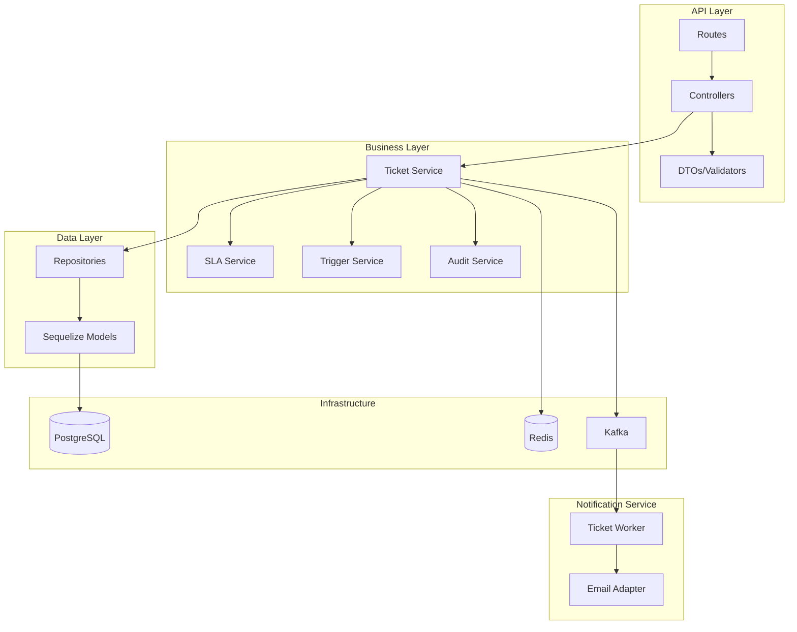
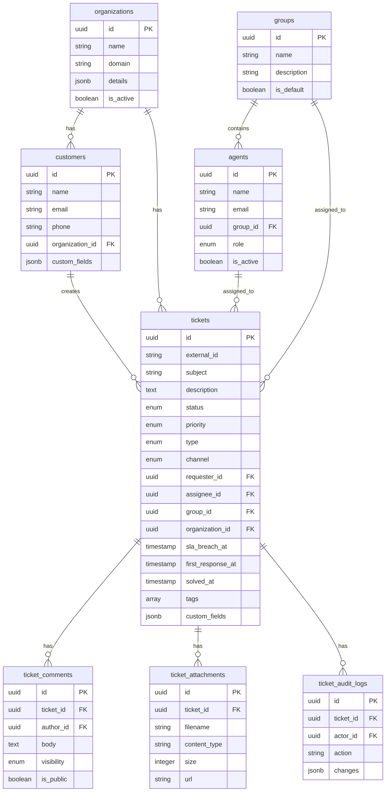

# Ticket Management Service - Implementation Plan

A customer support ticket management system similar to Zendesk Support API, built on top of the existing Notification-Service codebase.---

## Architecture Overview



---

## Database Schema



---

## Phase 1: Foundation and Database Schema

### 1.1 Add Enums

Update [src/Common/Constants/enums.ts](src/Common/Constants/enums.ts) with ticket-related enums:

- `TICKET_STATUS`: new, open, pending, on_hold, solved, closed
- `TICKET_PRIORITY`: low, normal, high, urgent
- `TICKET_TYPE`: question, incident, problem, task
- `TICKET_CHANNEL`: email, web, api, chat, phone
- `COMMENT_VISIBILITY`: public, internal
- `AGENT_ROLE`: admin, agent, light_agent

### 1.2 Create Database Migrations

Create migrations in `src/Migrations/` for:

- `organizations` - Customer companies
- `groups` - Agent groups (Billing, Technical, etc.)
- `agents` - Support agents
- `customers` - End-users/requesters
- `tickets` - Core ticket table
- `ticket_comments` - Ticket conversations
- `ticket_attachments` - File attachments
- `ticket_audit_logs` - Change history
- `ticket_tags` - Tag management
- `macros` - Canned responses
- `sla_policies` - SLA rules

---

## Phase 2: Models

Create Sequelize models in `src/Models/`:| Model | Description ||-------|-------------|| `Organization.model.ts` | Customer organizations || `Group.model.ts` | Agent groups || `Agent.model.ts` | Support agents || `Customer.model.ts` | End-users || `Ticket.model.ts` | Core ticket entity || `TicketComment.model.ts` | Comments/replies || `TicketAttachment.model.ts` | File attachments || `TicketAuditLog.model.ts` | Audit trail || `Macro.model.ts` | Canned responses || `SlaPolicy.model.ts` | SLA definitions |Update [src/Models/index.ts](src/Models/index.ts) to export all new models and register them with Sequelize in [src/Database/PostgresConnection.ts](src/Database/PostgresConnection.ts).---

## Phase 3: Repository Layer

Create repositories in `src/Repository/`:| Repository | Key Methods ||------------|-------------|| `Ticket.repository.ts` | create, findById, findByExternalId, findAll (with filters/pagination), update, bulkUpdate, getStatistics || `TicketComment.repository.ts` | create, findByTicketId, update, delete || `Customer.repository.ts` | create, findByEmail, findAll, update || `Agent.repository.ts` | create, findByEmail, findByGroup, update || `Group.repository.ts` | create, findAll, findWithAgents || `Organization.repository.ts` | create, findByDomain, findAll || `Macro.repository.ts` | create, findAll, findById || `SlaPolicy.repository.ts` | findByPriority, calculateBreachTime |---

## Phase 4: Service Layer

Create services in `src/Services/`:| Service | Responsibilities ||---------|-----------------|| `Ticket.service.ts` | Create, update, assign, merge, bulk operations || `TicketComment.service.ts` | Add comments, handle visibility || `Customer.service.ts` | Customer CRUD, search || `Agent.service.ts` | Agent management || `Sla.service.ts` | Calculate breach times, check violations || `Trigger.service.ts` | Auto-assignment, auto-reply rules || `AuditLog.service.ts` | Track all changes || `Macro.service.ts` | Apply canned responses || `Search.service.ts` | Full-text search across tickets/customers |---

## Phase 5: Validators (DTOs)

Create validation DTOs in `src/Validators/`:| DTO | Fields ||-----|--------|| `CreateTicket.dto.ts` | subject, description, priority, type, tags, customFields || `UpdateTicket.dto.ts` | subject, status, priority, assigneeId, groupId, tags || `TicketQuery.dto.ts` | status[], priority[], assigneeId, search, page, limit, sortBy || `CreateComment.dto.ts` | body, visibility, attachments || `Customer.dto.ts` | name, email, phone, organizationId || `Agent.dto.ts` | name, email, groupId, role |---

## Phase 6: Controllers and Routes

### Controllers in `src/Controllers/`:

- `Ticket.controller.ts`
- `TicketComment.controller.ts`
- `Customer.controller.ts`
- `Agent.controller.ts`
- `Group.controller.ts`
- `Organization.controller.ts`
- `Macro.controller.ts`
- `Search.controller.ts`

### Routes in `src/Routers/`:

- `Ticket.routes.ts` - `/api/v1/tickets`
- `Customer.routes.ts` - `/api/v1/customers`
- `Agent.routes.ts` - `/api/v1/agents`
- `Group.routes.ts` - `/api/v1/groups`
- `Organization.routes.ts` - `/api/v1/organizations`
- `Macro.routes.ts` - `/api/v1/macros`
- `Search.routes.ts` - `/api/v1/search`

Update [src/Routers/index.ts](src/Routers/index.ts) to register all new routes.---

## Phase 7: API Endpoints

### Tickets

| Method | Endpoint | Description ||--------|----------|-------------|| POST | `/api/v1/tickets` | Create ticket || GET | `/api/v1/tickets` | List with filters || GET | `/api/v1/tickets/:id` | Get ticket || PUT | `/api/v1/tickets/:id` | Update ticket || DELETE | `/api/v1/tickets/:id` | Soft delete || PUT | `/api/v1/tickets/update_many` | Bulk update || POST | `/api/v1/tickets/:id/merge` | Merge tickets |

### Comments

| Method | Endpoint | Description ||--------|----------|-------------|| POST | `/api/v1/tickets/:id/comments` | Add comment || GET | `/api/v1/tickets/:id/comments` | List comments |

### Customers

| Method | Endpoint | Description ||--------|----------|-------------|| POST | `/api/v1/customers` | Create customer || GET | `/api/v1/customers` | List customers || GET | `/api/v1/customers/:id` | Get customer || GET | `/api/v1/customers/:id/tickets` | Customer tickets |

### Agents, Groups, Organizations

Standard CRUD endpoints following the same pattern.---

## Phase 8: Notification Integration

### 8.1 Kafka Topics

Add topics to [src/Config/Kafka/producer.ts](src/Config/Kafka/producer.ts):

- `notifications.ticket.created`
- `notifications.ticket.assigned`
- `notifications.ticket.status_changed`
- `notifications.ticket.commented`
- `notifications.ticket.sla_warning`

### 8.2 Ticket Worker

Create `src/Worker/ticket.worker.ts` to consume ticket events and trigger email notifications via the existing [src/Orchestrator/orchestrator.service.ts](src/Orchestrator/orchestrator.service.ts).

### 8.3 Email Templates

Add ticket templates to [src/Templates/template.service.ts](src/Templates/template.service.ts):

- `ticket_created` - Confirmation to requester
- `ticket_assigned` - Notification to agent
- `ticket_status_changed` - Update to requester
- `ticket_new_comment` - Reply notification
- `ticket_sla_warning` - SLA warning to agent

---

## Phase 9: Background Jobs

Create `src/Jobs/TicketJobs.ts` with cron jobs:

- SLA breach checker (every 5 minutes)
- Auto-close solved tickets (daily)
- Satisfaction survey sender (on ticket solved)

---

## Phase 10: Additional Features

### 10.1 SLA Policies

- Define SLA rules per priority level
- Calculate breach times automatically
- Send warnings before breach
- Track SLA compliance metrics

### 10.2 Macros (Canned Responses)

- Create reusable response templates
- Apply macros to tickets (updates fields + adds comment)

### 10.3 Triggers (Automation)

- Auto-assign based on conditions
- Auto-reply for new tickets
- Escalation rules

---

## File Structure Summary

```javascript

	
	src/
├── Common/Constants/
│   └── enums.ts                    # Add ticket enums
├── Migrations/
│   └── 20250120-xxx-*.js           # 10+ new migrations
├── Models/
│   ├── Organization.model.ts
│   ├── Group.model.ts
│   ├── Agent.model.ts
│   ├── Customer.model.ts
│   ├── Ticket.model.ts
│   ├── TicketComment.model.ts
│   ├── TicketAttachment.model.ts
│   ├── TicketAuditLog.model.ts
│   ├── Macro.model.ts
│   └── SlaPolicy.model.ts
├── Repository/
│   ├── Ticket.repository.ts
│   ├── TicketComment.repository.ts
│   ├── Customer.repository.ts
│   ├── Agent.repository.ts
│   ├── Group.repository.ts
│   └── Organization.repository.ts
├── Services/
│   ├── Ticket.service.ts
│   ├── TicketComment.service.ts
│   ├── Customer.service.ts
│   ├── Agent.service.ts
│   ├── Sla.service.ts
│   ├── Trigger.service.ts
│   ├── AuditLog.service.ts
│   └── Search.service.ts
├── Controllers/
│   ├── Ticket.controller.ts
│   ├── Customer.controller.ts
│   ├── Agent.controller.ts
│   └── ...
├── Routers/
│   ├── Ticket.routes.ts
│   ├── Customer.routes.ts
│   └── ...
├── Validators/
│   ├── Ticket.dto.ts
│   ├── Customer.dto.ts
│   └── ...
├── Worker/
│   └── ticket.worker.ts
├── Jobs/
│   └── TicketJobs.ts
└── Templates/
    └── template.service.ts         # Add ticket templates

```